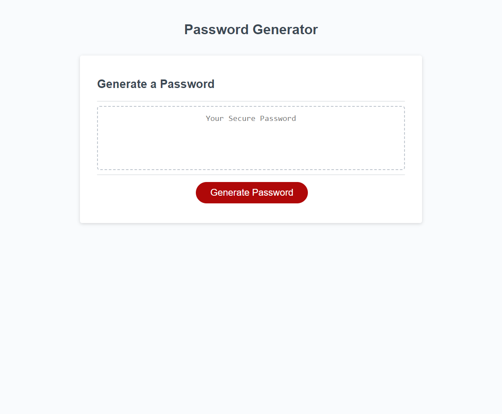

# Module 3 Challenge: Password Generator

## Description

This project was made to test JavaScript and its most used codes including if, functions, and variables. 
It was designed to be a basic password generator to give a choice of 8 through 128 characters,
and allow numbers and special characters as options.

## Installation

What are the steps required to install your project? Provide a step-by-step description of how to get the development environment running.

## Usage

Click on the button and answer the prompts. The generator will give you a password in result of your choosing.

## Credits

William Horn
https://www.youtube.com/watch?v=JheVaV6bPvE

## License

Refer to repo